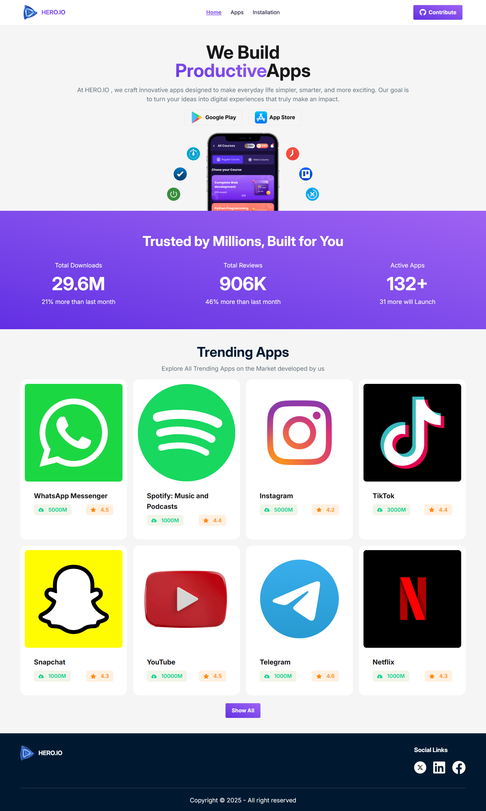

# 📱 App Listing Website

A modern and responsive **App Listing Web Application** where users can explore trending apps, view details, and discover popular platforms easily.

---

## 🚀 Live Preview  
👉 [Visit Website](https://web-application-stor.netlify.app/)

---

## 📸 Screenshot  

---

## ✨ Features  

- 📱 Trending apps section (WhatsApp, Spotify, Instagram, TikTok, etc.)
- 🔍 View app details with rating, downloads, and reviews  
- 🎨 Clean and modern UI design  
- 📊 Dynamic data rendering using JSON  
- ⚡ Fully responsive (mobile, tablet, desktop)  
- 🚀 Fast performance and smooth user experience  

---

## 🛠️ Technologies Used  

- ⚛️ React.js  
- 🎨 Tailwind CSS  
- 📦 JSON Data  
- 🌐 JavaScript (ES6+)  

---

## 📂 Project Structure  

